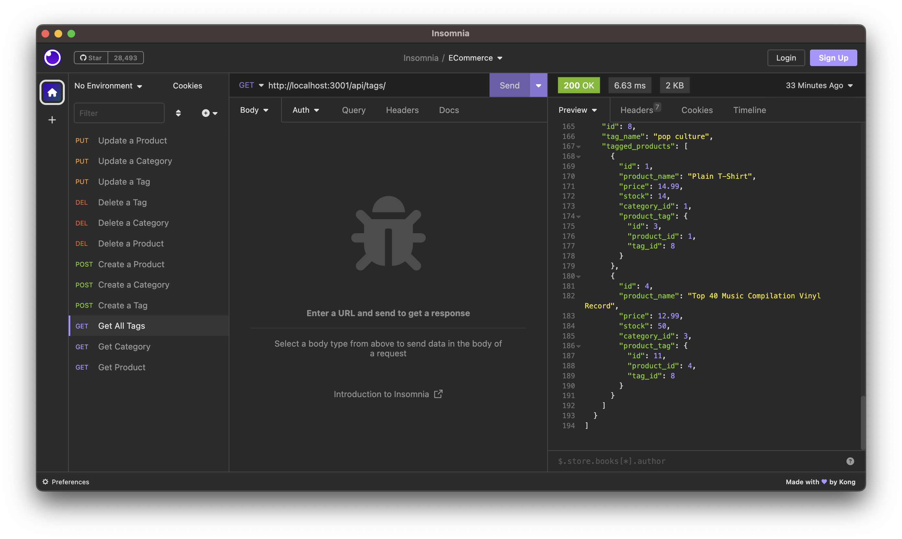

# E-Commerce Backend Engine

## Description

In the era of online shopping, having an efficient and performant backend system for e-commerce platforms is a necessity. The E-Commerce Backend Engine is built to cater to this need.

- Motivation: The motivation behind this project was to help internet retail companies by providing them a robust and efficient backend engine.
- Purpose: This project aims to facilitate e-commerce businesses in staying competitive by using the latest technologies for their backend services.
- Problem Solving: The project solves the problem of managing an e-commerce database and API efficiently and effectively.
- Learning Outcome: Through this project, we mastered Express.js API configurations and Sequelize interactions with MySQL databases.

## Table of Contents

- [Installation](#installation)
- [Usage](#usage)
- [Credits](#credits)
- [License](#license)
- [Features](#features)
- [How to Contribute](#how-to-contribute)
- [Tests](#tests)

## Installation

1. Clone the repository to your local machine.
2. Navigate to the root directory of the project.
3. Run `npm install` to install all dependencies.
4. Create a `.env` file to store your MySQL credentials and database information.
5. Run the commands to create and seed the database:
    ```
    npm run schema
    npm run seeds
    ```
6. Start the server by running `npm start`.

## Usage

1. To start the server, run `npm start`.
2. Use a tool like Insomnia or Postman to test the API endpoints.
3. API GET routes for categories, products, and tags can be tested to view the data in formatted JSON.
4. API POST, PUT, and DELETE routes can also be tested to perform CRUD operations on the database.



https://drive.google.com/file/d/1SfixGJa0mEP1CsSW2-zR8r8WR9QQ3Yx_/view

## Credits

This project was developed by [Samuel Munguia](https://github.com/samuel-6).

## License


This project is licensed under the MIT License. For more information, please refer to [https://choosealicense.com/licenses/mit/](https://choosealicense.com/licenses/mit/).

## Features

- Robust API endpoints for products, categories, and tags.
- Seamless integration with MySQL using Sequelize.
- Efficient error handling and data validation.
- Scalable architecture suitable for small to large e-commerce platforms.

## How to Contribute

Contributions are always welcome! To contribute:

1. Fork the project.
2. Create a new branch (`git checkout -b new-feature`).
3. Commit the changes (`git commit -am 'Add a new feature'`).
4. Push to the branch (`git push origin new-feature`).
5. Submit a pull request.

## Tests

1. Run `npm test` to execute the tests.
2. All test results will be displayed in the console.

Feel free to write more tests for additional functionalities.